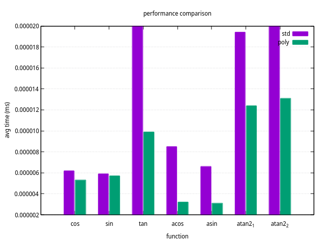

# Trigonometric functions polynomial interpolation #
Version 0.5

### Description ###

Trigonometic functions using polynomial interpolation.
Implemented just because it's possible. Can be evaluated at compile time.
Usage:

    constexpr size_t polynomial_degree = 5;
    using floating_point_type = float;

    using math = trigonometry<float, polynomial_degree>;

    std::cout<<"sin(pi): "<<math::sin(M_PI)<<std::endl;
    std::cout<<"cos(pi): "<<math::cos(M_PI)<<std::endl;
    std::cout<<"tan(pi): "<<math::tan(M_PI)<<std::endl;

    std::cout<<"asin(0): "<<math::asin(0)<<std::endl;
    std::cout<<"acos(0): "<<math::acos(0)<<std::endl;
    std::cout<<"atan2(1, 0): "<<math::atan2(1,0)<<std::endl;

Benchmarks results with fifth degree polynomial on linux using GCC:
    

### Preparing and compiling ###

Just add "include" directory to paths to use it in your project.
Use CMake to build sample and benchmark.
Benchmark needs gnuplot in your paths in order to render plots.

### Contact ###

e-mail: vuslavust at gmail.com
